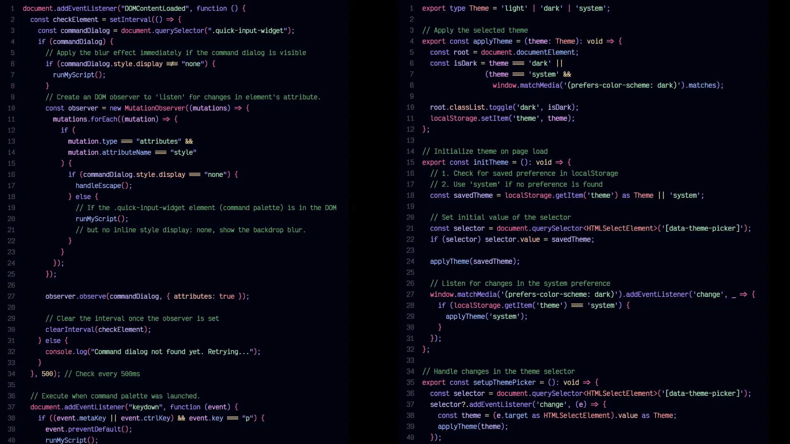
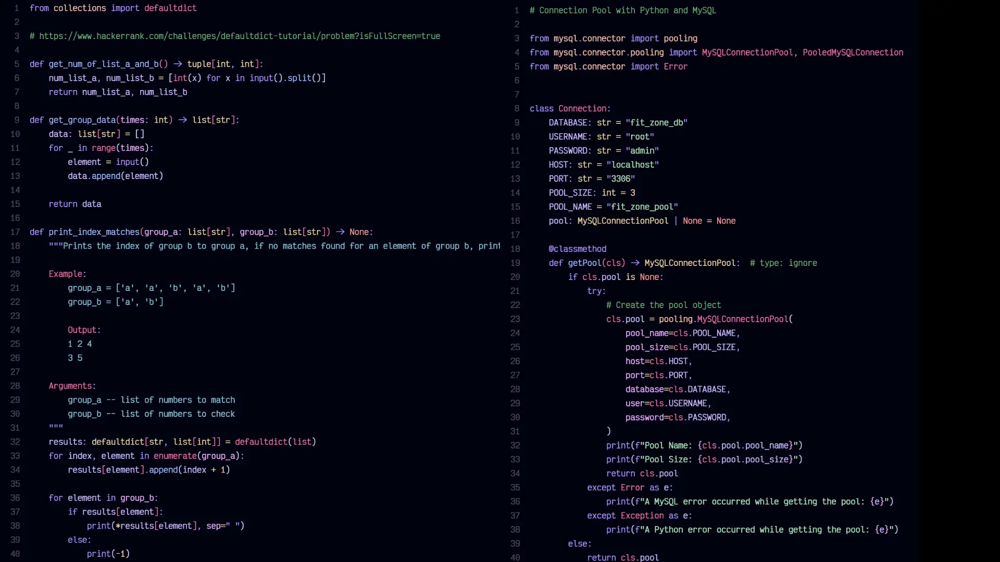
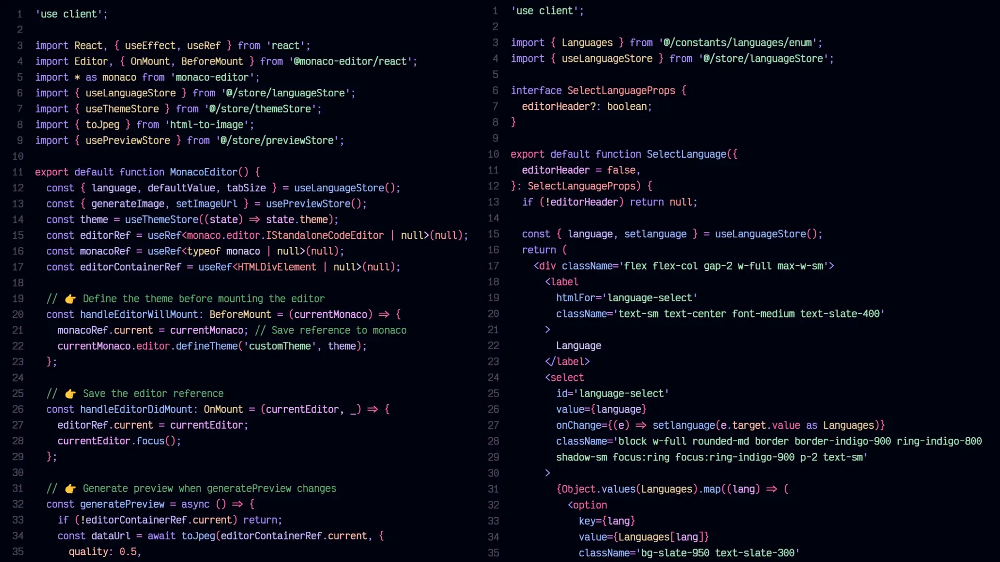
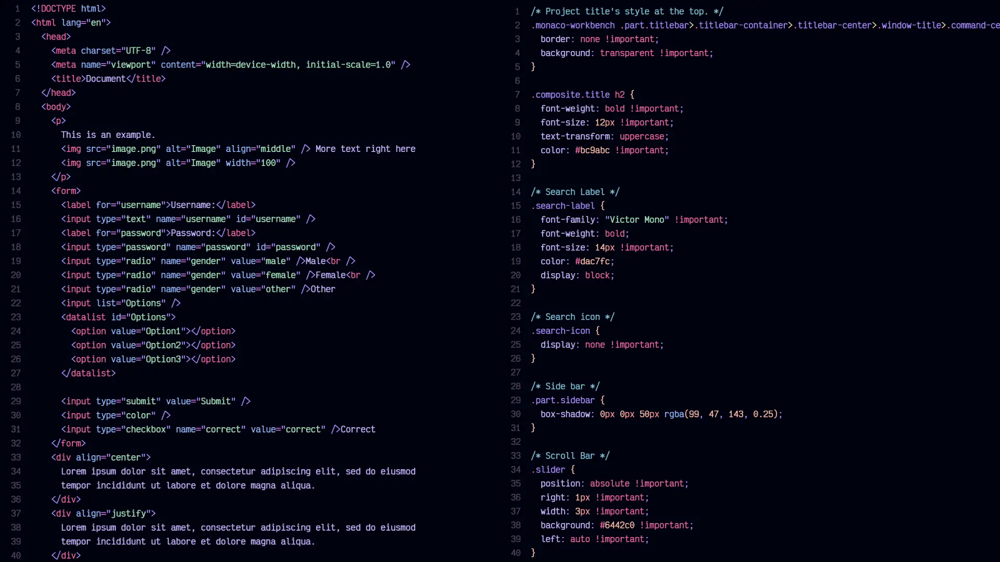
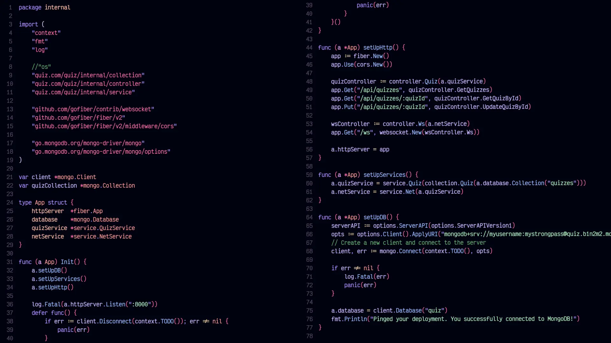
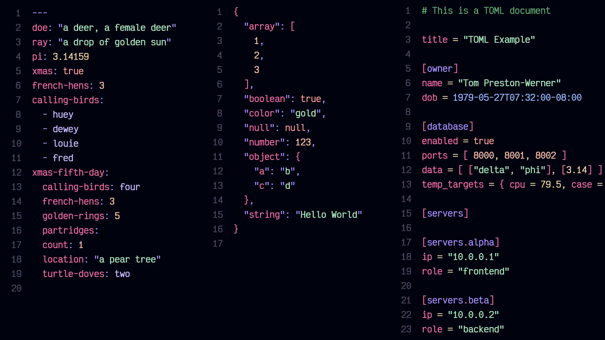

# Jacaranda Theme 🌸

A beautiful and vibrant VS Code theme inspired by the stunning purple blooms of the Jacaranda tree.
This theme brings elegance and readability to your coding experience with carefully crafted colors
that reduce eye strain while maintaining excellent syntax highlighting.

## ✨ Features

- **Beautiful Color Palette**: Inspired by nature's most stunning purple flowers
- **Eye-friendly**: Carefully selected colors to reduce eye strain during long coding sessions
- **High Contrast**: Excellent readability for all supported languages
- **Consistent Syntax Highlighting**: Unified color scheme across all file types

## 🎯 Language Support

Jacaranda Theme provides optimized syntax highlighting for:

- **JavaScript** & **TypeScript** - Modern web development
- **Python** - Data science and backend development
- **C** & **C++** - System programming
- **HTML** & **CSS** - Web markup and styling
- **Go** - Modern backend development
- **Java** - Enterprise development
- **React** - Component-based UI development
- **Astro** - Modern web framework
- **Prisma** - Database toolkit
- **Markdown** - Documentation
- **YAML** & **TOML** - Configuration files
- **JSON** - Data interchange format

> 🚀 **Coming Soon**: More languages will be added in future updates based on community feedback!

## 🎨 Color Palette

Our carefully curated color palette combines vibrant purples with complementary accent colors:

### 🎨 **Primary Purples** 💜

| Original Name     | Color Badge                                                                                              | Value (HEX) |
| ----------------- | -------------------------------------------------------------------------------------------------------- | ----------- |
| Lunar Lavender    |   | `#ccb5ff`   |
| Imperial Violet   |   | `#ae89ff`   |
| Dawn Orchid       |  | `#f0a6ff`   |
| Enchanted Magenta |  | `#e484fc`   |

---

### 🌸 **Accent Colors** ✨

| Original Name   | Color Badge                                                                                              | Value (HEX) |
| --------------- | -------------------------------------------------------------------------------------------------------- | ----------- |
| Cosmic Pink     |  | `#ee80ff`   |
| Juicy Raspberry |  | `#ff66a6`   |
| Sunset Coral    |     | `#ff9494`   |
| Delicate Peach  |  | `#ffbba6`   |

---

### 🌿 **Supporting Colors** 🍃

| Original Name    | Color Badge                                                                                                      | Value (HEX) |
| ---------------- | ---------------------------------------------------------------------------------------------------------------- | ----------- |
| Clear Sky        |  | `#94b9ff`   |
| Golden Wheat     |           | `#ebce99`   |
| Soft Mint        |              | `#A1E2B7`   |
| Jungle Emerald   |          | `#5DAF6F`   |
| Light Seafoam    |           | `#a1e2dd`   |
| Serene Turquoise |  | `#7dc1d6`   |

### Color Usage

- **Keywords & Control Flow**: Primary purples for `if`, `else`, `function`, `class`
- **Strings, Text & Comments**: Soft greens for subtle visibility
- **Functions**: Sky blue and periwinkle for clarity
- **Operators**: Golden wheat for visual distinction

## 📸 Screenshots

### JavaScript/TypeScript



### Python



### React/JSX



### HTML/CSS



### Go



### Configuration Files (YAML/JSON/TOML)



## 🚀 Installation

### Via VS Code Marketplace

1. Open VS Code
2. Go to Extensions (`Ctrl+Shift+X` / `Cmd+Shift+X`)
3. Search for "Jacaranda Theme"
4. Click Install
5. Go to `File > Preferences > Color Theme` and select "Jacaranda Theme"

### Manual Installation

1. Download the theme files
2. Copy to your VS Code extensions folder:
   - **Windows**: `%USERPROFILE%\.vscode\extensions`
   - **macOS**: `~/.vscode/extensions`
   - **Linux**: `~/.vscode/extensions`
3. Restart VS Code
4. Select the theme from Color Theme preferences

## ⚙️ Recommended Settings

For the best experience with Jacaranda Theme, consider these VS Code settings:

```json
{
  "editor.fontFamily": "Victor Mono",
  "editor.fontSize": 15,
  "editor.lineHeight": 1.5,
  "editor.fontLigatures": true,
  "editor.cursorBlinking": "smooth",
  "editor.bracketPairColorization.enabled": true
}
```

## 🐛 Issues & Feedback

Found a bug or have a suggestion? We'd love to hear from you!

- **Issues**: [Report bugs or request features](https://github.com/josuebautista/jacaranda-theme/issues)
- **Discussions**: [Join the community discussion](https://github.com/josuebautista/jacaranda-theme/discussions)

## 🤝 Contributing

We welcome contributions! Whether it's:

- Adding support for new languages
- Improving existing syntax highlighting
- Fixing color contrast issues
- Updating documentation

## 📄 License

This theme is licensed under the [MIT License](LICENSE).

## 💜 Inspiration

Named after the beautiful Jacaranda tree, known for its stunning purple blooms that create breathtaking natural canopies. Just like these magnificent trees bring beauty to landscapes, we hope this theme brings beauty and clarity to your code.

---

**Enjoy coding with Jacaranda Theme!** 🌸

_If you love this theme, please consider leaving a ⭐ review on the marketplace!_
